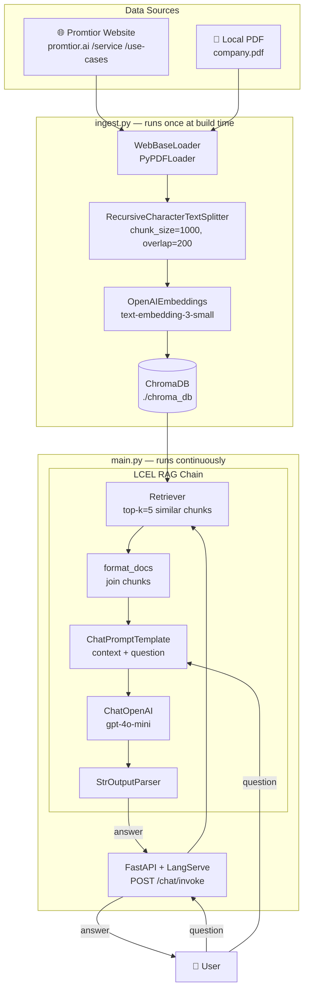
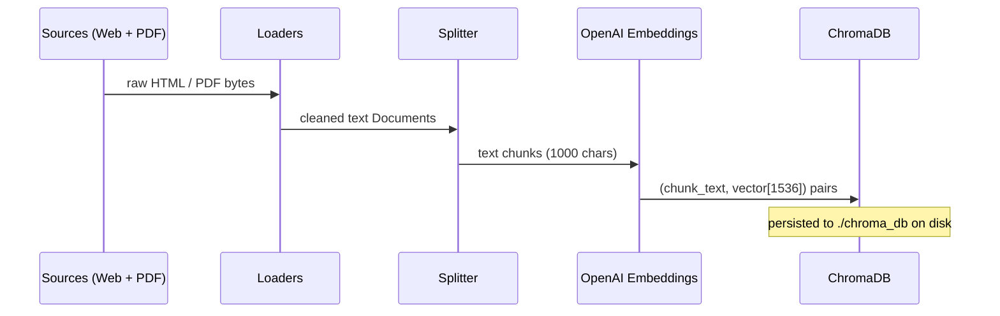
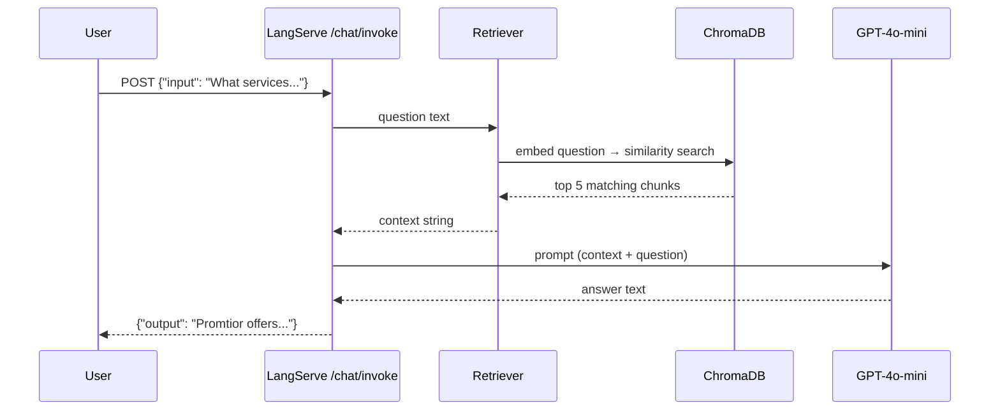

# Component Diagram

## Full System

```mermaid
flowchart TD
    subgraph Sources["Data Sources"]
        WEB["🌐 Promtior Website\npromtior.ai /service /use-cases"]
        PDF["📄 Local PDF\ncompany.pdf"]
    end

    subgraph Ingestion["ingest.py — runs once at build time"]
        LOADER["WebBaseLoader\nPyPDFLoader"]
        SPLITTER["RecursiveCharacterTextSplitter\nchunk_size=1000, overlap=200"]
        EMBEDDER["OpenAIEmbeddings\ntext-embedding-3-small"]
        DB[("ChromaDB\n./chroma_db")]
    end

    subgraph Server["main.py — runs continuously"]
        subgraph Chain["LCEL RAG Chain"]
            RETRIEVER["Retriever\ntop-k=5 similar chunks"]
            FORMAT["format_docs\njoin chunks"]
            PROMPT["ChatPromptTemplate\ncontext + question"]
            LLM["ChatOpenAI\ngpt-4o-mini"]
            PARSER["StrOutputParser"]
        end
        API["FastAPI + LangServe\nPOST /chat/invoke"]
    end

    USER["👤 User"]

    WEB --> LOADER
    PDF --> LOADER
    LOADER --> SPLITTER
    SPLITTER --> EMBEDDER
    EMBEDDER --> DB

    DB --> RETRIEVER
    USER -->|question| API
    API --> RETRIEVER
    RETRIEVER --> FORMAT
    FORMAT --> PROMPT
    USER -->|question| PROMPT
    PROMPT --> LLM
    LLM --> PARSER
    PARSER -->|answer| API
    API -->|answer| USER
```

## Ingestion Pipeline (detail)

```mermaid
sequenceDiagram
    participant S as Sources (Web + PDF)
    participant L as Loaders
    participant SP as Splitter
    participant E as OpenAI Embeddings
    participant C as ChromaDB

    S->>L: raw HTML / PDF bytes
    L->>SP: cleaned text Documents
    SP->>E: text chunks (1000 chars)
    E->>C: (chunk_text, vector[1536]) pairs
    Note over C: persisted to ./chroma_db on disk
```

## Query Flow (detail)

```mermaid
sequenceDiagram
    participant U as User
    participant LS as LangServe /chat/invoke
    participant R as Retriever
    participant C as ChromaDB
    participant LLM as GPT-4o-mini

    U->>LS: POST {"input": "What services..."}
    LS->>R: question text
    R->>C: embed question → similarity search
    C-->>R: top 5 matching chunks
    R-->>LS: context string
    LS->>LLM: prompt (context + question)
    LLM-->>LS: answer text
    LS-->>U: {"output": "Promtior offers..."}
```
